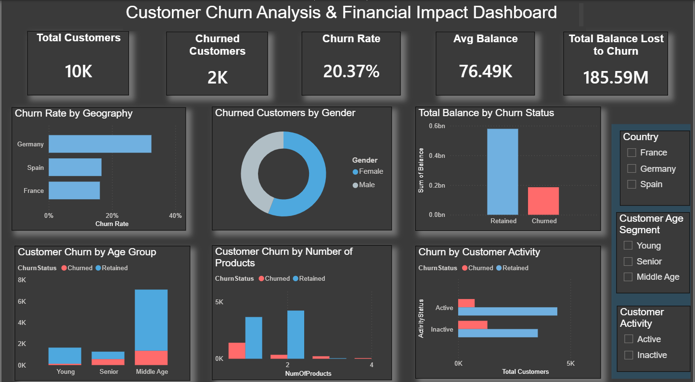

# Customer Churn Analysis & Financial Impact Dashboard

## Project Overview
Customer churn is a critical challenge for businesses, especially in banking and subscription-based services. Understanding why customers leave helps organizations improve retention strategies and reduce financial losses.

This project analyzes customer churn patterns and visualizes key drivers using SQL and Power BI.

---

## Tools & Technologies
- SQL (MySQL)
- Power BI
- Data Cleaning & Transformation
- Data Visualization
- Business Analysis

---

## Dashboard Overview

The dashboard provides insights into:

- Customer churn rate
- Geographic churn distribution
- Customer demographics and behavior
- Product usage impact on churn
- Financial impact of churn

### Dashboard Preview

---

## Key Metrics

- Total Customers: **10,000**
- Churned Customers: **2,037**
- Churn Rate: **20.37%**
- Average Customer Balance: **76.49K**
- Total Balance Lost to Churn: **185.59M**

---

## Features of Dashboard

1. KPI cards showing overall churn metrics
2. Geographic churn comparison
3. Demographic churn segmentation
4. Product usage analysis
5. Customer activity impact on churn
6. Financial impact visualization
7. Interactive filters for deeper analysis

---

## Project Structure

Customer-Churn-Analysis_Dashboard
│
├── README.md
├── Key_Insights.md
├── data
├── sql
├── powerbi
├── images

---

## How to Use

1. Download the dataset from the **data folder**
2. Run SQL scripts inside the **sql folder**
3. Open the Power BI dashboard (.pbix file)
4. Interact with filters to explore churn patterns

---

## Business Value

This analysis helps businesses:

- Identify high-risk customer segments
- Understand behavioral churn drivers
- Estimate financial impact of churn
- Develop targeted retention strategies
